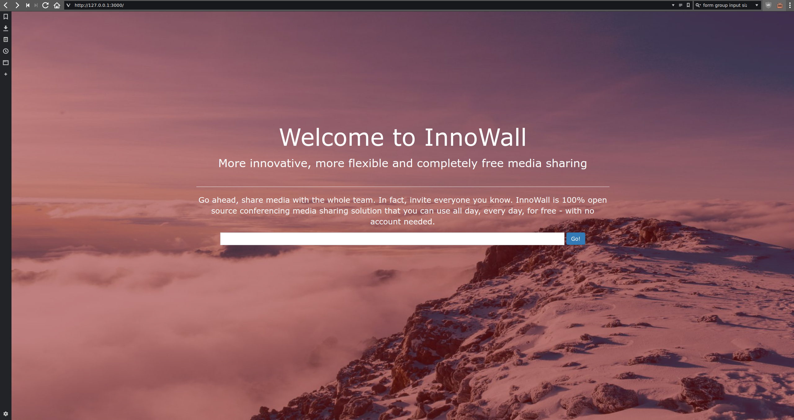
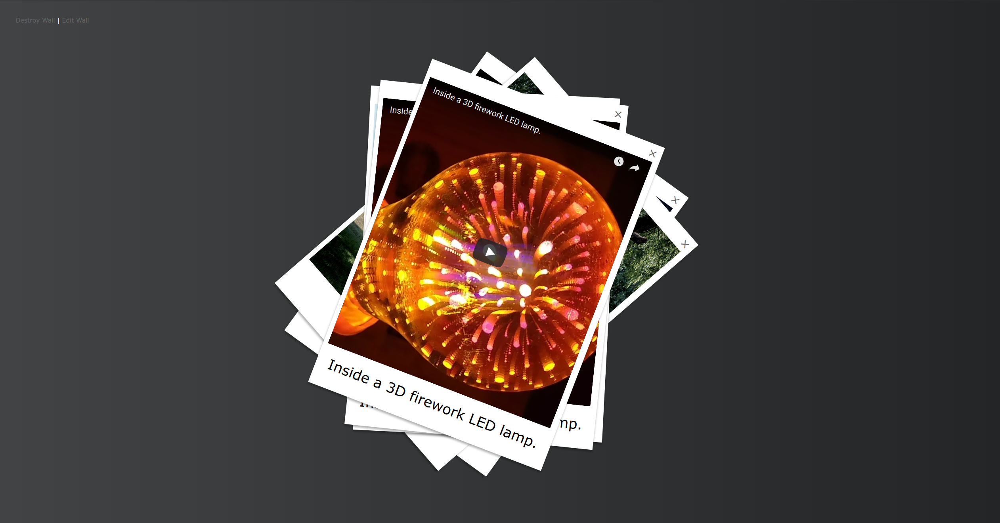

# Welcome to InnoWall
## More innovative, more flexible and completely free media sharing

Go ahead, share media with the whole team. In fact, invite everyone you know. InnoWall is 100% open source conferencing media sharing solution that you can use all day, every day, for free - with no account needed.

New Walls can be created by typing a unique url or word either as url or just in the textbox of the startpage.

While creating new walls you can allow a range of media types and restrict the location.

Created walls then look like this.

InnoWal is also full responsive

## Mobile Apps for Android and IOs comming soon...
